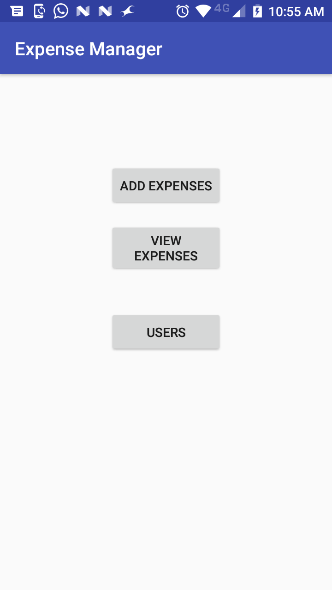
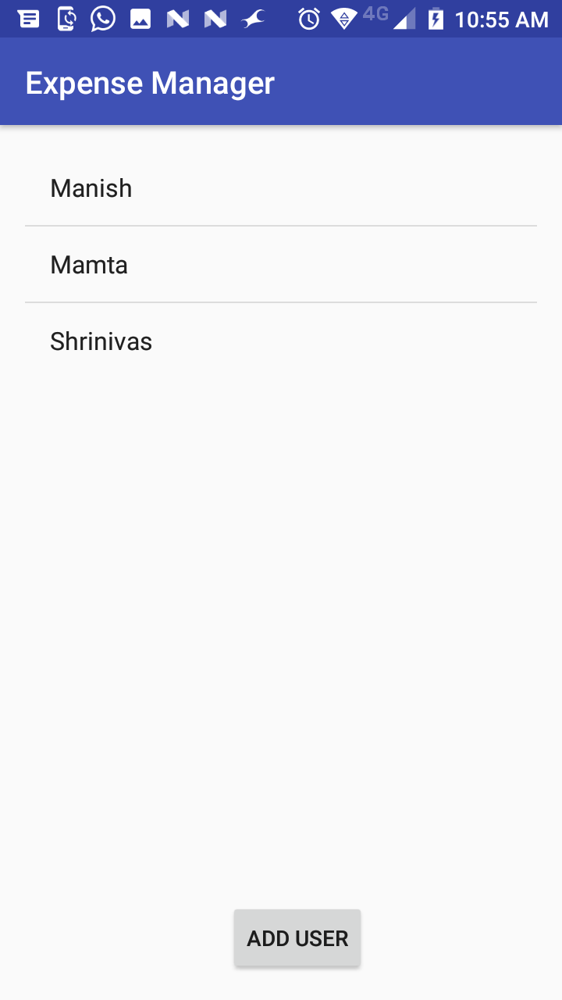
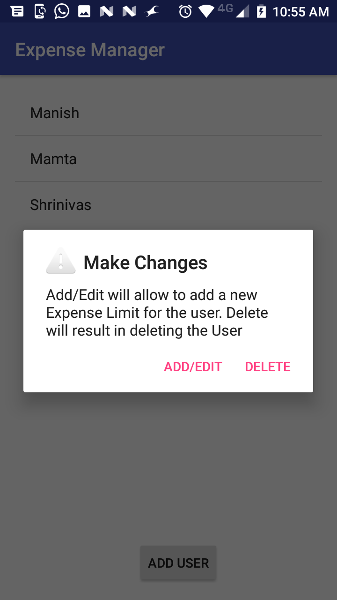
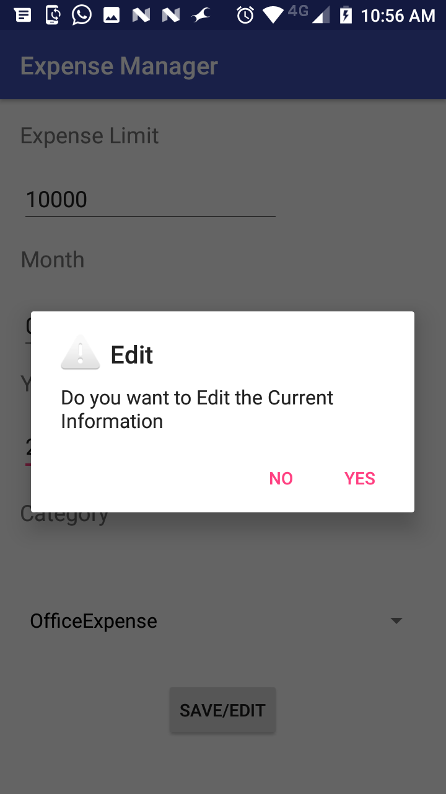
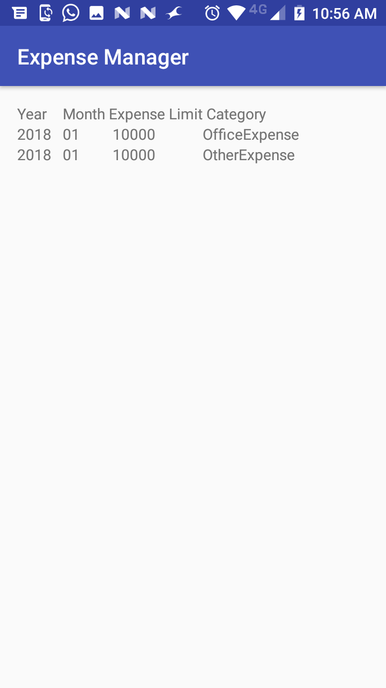
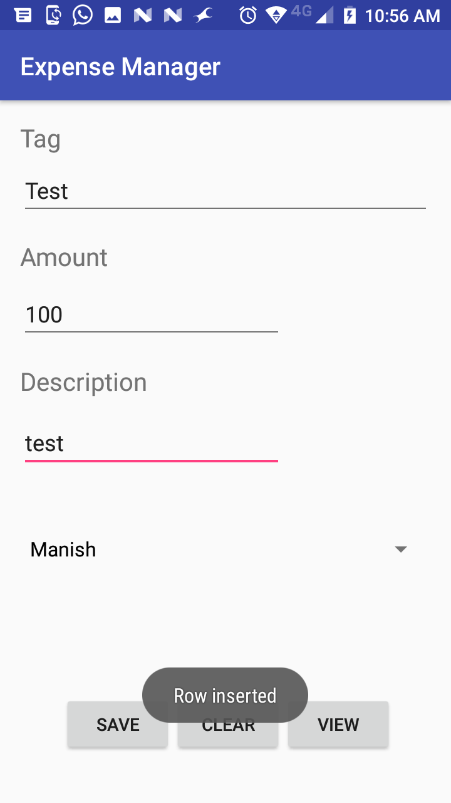
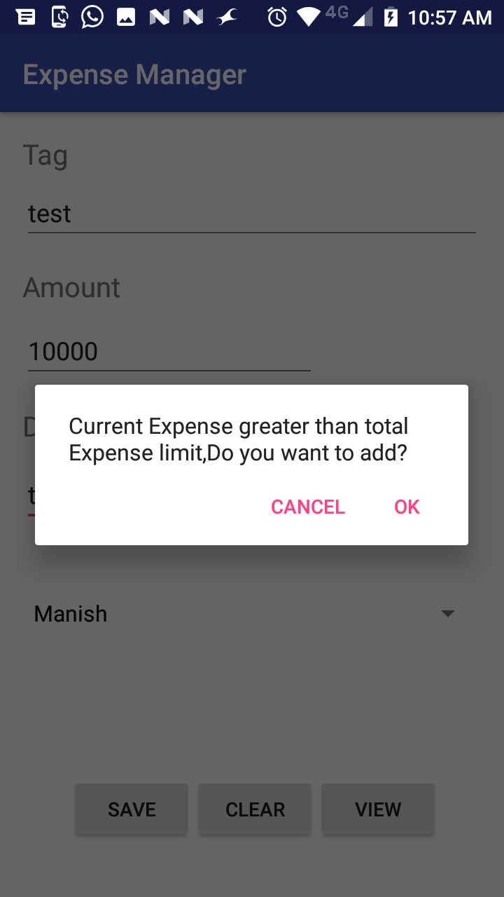
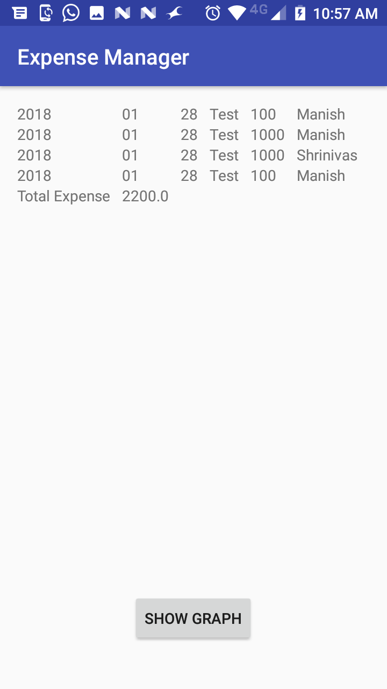
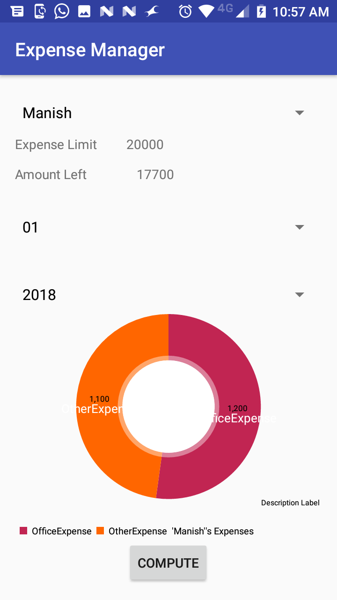

# Expense-Manager
* This App allows User to manage his expense. 
* Number of Users can be added.
* User can add different Categories of Expenditure. 
* For each category user has to set expense limits every month.
* Alerts a User whenever expense goes beyond expense limit.
* Expenses of a User can be seen category-wise or overall in all categories by means of pie chart and line graph.

